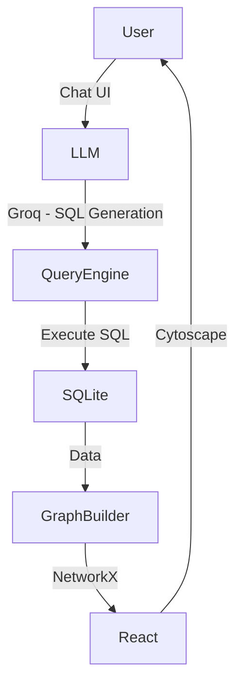

# Graph-Based Data Modeling and LLM Query System

A full-stack system that transforms fragmented business data into a connected graph and enables natural language querying using LLMs.

---

## 🚀 Overview

In real-world enterprise systems, data is scattered across multiple tables such as Orders, Deliveries, Invoices, and Payments. This project unifies these disconnected datasets into a **context-aware graph** and allows users to query relationships using **natural language**.

The system combines:
- Graph modeling (NetworkX)
- Relational querying (SQLite)
- LLM-powered SQL generation (Groq - LLaMA 3.3)
- Interactive visualization (React + Cytoscape.js)

---

## 🧠 Key Features

### 1. Data Ingestion Engine
- Parses structured JSONL/CSV datasets (SAP Order-to-Cash flow)
- Normalizes and stores data in SQLite
- Handles nested relationships dynamically

### 2. Graph Construction
- Converts relational data into a directed graph using NetworkX
- Nodes represent business entities
- Edges represent relationships across systems

### 3. LLM-Powered Query Engine
- Converts natural language → SQL queries using Groq API
- Executes SQL on SQLite
- Returns data-backed responses in natural language

### 4. Interactive Graph Visualization
- Built using Cytoscape.js
- Expand nodes and explore relationships
- Highlight nodes involved in query results

### 5. Guardrails & Safety
- Restricts queries strictly to dataset domain
- Rejects irrelevant or unsafe queries
- Prevents invalid SQL execution

---

## 🏗️ System Architecture



---

## 📦 Tech Stack

**Backend:**
- Python
- FastAPI
- SQLite
- NetworkX

**Frontend:**
- React (Vite)
- Cytoscape.js
- Tailwind CSS

**LLM:**
- Groq API (LLaMA 3.3 70B)

---

## 📁 Project Structure
```text
backend/
├── main.py
├── database.py
├── graph_builder.py
├── query_engine.py
├── llm_service.py

frontend/
├── src/
│ ├── components/
│ │ ├── GraphView.jsx
│ │ ├── ChatBox.jsx
```

---

## ⚙️ Setup Instructions

### 1. Clone Repository

```bash
git clone "https://github.com/KSurendra1/Graph-Based-Data-Modeling-and-LLM-Query-System.git"
cd Graph-Based-Data-Modeling-and-LLM-Query-System
```

### 2. Backend Setup
```bash
cd backend
python -m venv venv

# Activate environment (Windows):
venv\Scripts\activate

# Activate environment (Mac/Linux):
source venv/bin/activate

# Install dependencies:
pip install -r requirements.txt
```

**Add `.env` file in the backend directory:**
```env
GROQ_API_KEY=your_api_key_here
```

**Run server:**
```bash
uvicorn main:app --port 8000
```

### 3. Frontend Setup
```bash
cd ../frontend
npm install
npm run dev
```
Open your browser to: **http://localhost:5173**

---

## 💬 Example Queries
*Test the system's reasoning capabilities by typing these into the ChatBox:*

- *"Which products have the highest number of invoices?"*
- *"Trace the full flow of billing document 91150187"*
- *"Find orders that were delivered but not billed"*
- *"Show customers with the highest payments"*

---

## 🔍 Graph Data Model

**Nodes:**
`Customer`, `Order`, `OrderItem`, `Product`, `Delivery`, `Invoice`, `Payment`, `Address`

**Relationships:**
- `Customer` → `Order`
- `Order` → `OrderItem`
- `OrderItem` → `Product`
- `Order` → `Delivery`
- `Delivery` → `Invoice`
- `Invoice` → `Payment`
- `Customer` → `Address`

---

## 🤖 LLM Prompting Strategy
- **Schema-aware prompting** (tables + relationships defined explicitly)
- **Strict SQL-only response enforcement**
- **Regex-based SQL extraction** for safe execution
- **Post-processing** for natural language responses

## 🛡️ Guardrails
- Rejects non-domain queries
- Prevents hallucinated answers
- Handles invalid SQL safely
- Returns fallback message: *"This system only answers dataset-related queries."*

---

## ⚖️ Design Decisions

**Why SQLite?**
- Lightweight and easy to setup
- Perfect for structured querying with LLM-generated SQL
- No external dependencies

**Why NetworkX?**
- Flexible graph construction
- Easy integration with Python backend
- Works well for MVP without Neo4j complexity

**Why Not Neo4j?**
- Adds setup overhead
- Not necessary for assignment scope
- Focus is on modeling, not tooling

---

## 🚀 Future Improvements
- Neo4j integration for large-scale graph queries
- Streaming LLM responses
- Conversation memory
- Semantic search over entities
- Role-based access control

---

## 📊 Evaluation Alignment
This project demonstrates:
1. Strong graph modeling from relational data
2. Clean backend architecture
3. Effective LLM usage with prompt engineering
4. Robust guardrails
5. Real-world system thinking

**👨‍💻 Author**: K Surendra Kumar  
**GitHub**: [KSurendra1](https://github.com/KSurendra1)

*Note: This project is built as part of a Forward Deployed Engineer assignment focusing on Data modeling, System design, LLM integration, and Real-world problem solving.*
